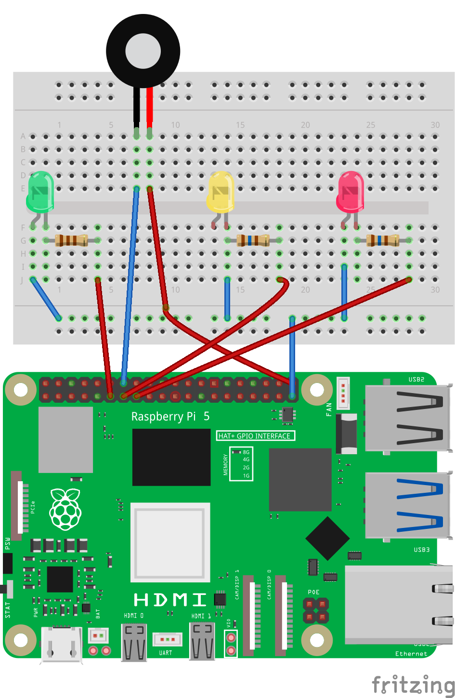

[](https://github.com/alanmugiwara)

[](https://github.com/alanmugiwara/jiboia-rasp-quiz)

[](https://github.com/alanmugiwara)
[](https://github.com/alanmugiwara)
[](https://github.com/alanmugiwara)

# 🎮 Jibóia Rasp Quiz
### Quiz educativo com Raspberry Pi + eletrônica básica


Projeto educativo em modo texto que roda pelo terminal, desenvolvido em Python para Raspberry Pi, combinando programação e integração com hardware através de LEDs e um buzzer.

O objetivo do jogo é ensinar, de forma divertida, conceitos de programação, eletrônica e integração com hardware para crianças, adolescentes e qualquer pessoa interessada por tecnologia sem conhecimento prévio.

## ⚙️ Funcionalidades
- 🎯 Quiz interativo em modo texto
- 💡 Feedback visual com LEDs
- 🔊 Feedback sonoro com buzzer
- 🎵 Música de encerramento no buzzer
- 🧠 Perguntas educativas
- 📊 Sistema de pontuação
- 🔁 Opção de jogar novamente

## 🧰 Hardware utilizado
- Raspberry Pi 5
- Protoboard mini de 30 pontos
- LED Verde + resistor 110 ohms
- LED Amarelo + resistor 160 ohms
- LED Vermelho + resistor 160 ohms 
- Buzzer 5v (alimentado com 3.3v)
- Jumpers (para compartilhar o aterramento)

## 💻 Sistema operacional utilizado
GNU/Linux DietPi v10.3.3 

## 📌 Portas GPIO Utilizadas
| Componente | GPIO |
|---|---|
| LED Verde | GPIO 17 |
| LED Amarelo | GPIO 27 |
| LED Vermelho | GPIO 22 |
| Buzzer | GPIO 21 |

## 🐍 Tecnologias utilizadas
- Python v3.11.2
- Fritzing v1.0.5 (Ferramenta para criação de esquemas elétricos)

## 📦 Dependências
- gpiozero v2.0.1
- lgpio v0.2.2.0
- colorama v0.4.6

## 💻 Requisitos mínimos
- Raspberry Pi (qualquer modelo com GPIO)
- Sistema operacional GNU/Linux

## ⚡ Esquema elétrico


O projeto do esquema está disponível em `circuit/fritzing-project.fzz`

## 🚀 Como reproduzir e executar?
**1. Clone o repositório**

```bash
git clone https://github.com/alanmugiwara/jiboia-rasp-quiz.git
```

**2. Entre na pasta:**

```bash
cd jiboia-rasp-quiz
```

**3. Crie o ambiente virtual (recomendado)**

```bash
python3 -m venv .venv
```

**4. Ativar o ambiente**

```bash
source .venv/bin/activate
```

**5. Instalar as dependências**

```bash
pip install -r requirements.txt
```

**6. Executar a aplicação**

```bash
sudo .venv/bin/python3 src/main.py
```

## 🎮 Como funciona o jogo?

Quem joga responde perguntas digitando uma das opções:

```txt
A, B, C, D
```

Cada resposta gera uma interação física na Raspberry Pi:

| Situação | Ação |
|---|---|
| ✅ Resposta correta | LED verde + vários bips rápidos |
| ❌ Resposta errada | LED vermelho + bip longo |
| ⚠️ Resposta inválida | LED amarelo + dois bips rápidos |

No final do jogo:
- A pontuação é exibida
- Uma música é reproduzida através do buzzer
- É possível reiniciar a partida


## 📚 Objetivo educacional
O projeto foi criado para:

- Incentivar crianças e iniciantes a aprender tecnologia
- Introduzir lógica de programação
- Demonstrar integração entre software e hardware
- Demonstrar conceitos básicos de eletrônica
- Tornar o aprendizado mais divertido

## 🛠️ Estrutura do projeto
```txt
jiboia-rasp-quiz/
│
├── src/
│   └── main.py
│
├── circuit/
│   ├── fritzing-breadboard.png
│   ├── jiboia-rasp-quiz.fzz
│   └── component-models/
│       ├── buzzer.fzpz
│       └── raspberrypi5.fzpz
│
├── requirements.txt
├── logo.png
└── README.md
```

## ⚠️ Observações
- O projeto foi desenvolvido para Raspberry Pi e não Arduino
- Utilize componentes compatíveis com 3.3v
- É necessário acesso root para controlar as GPIO
- O diretório `circuit/` contém os projetos do circuito e modelos (Raspberry pi 5 e Buzzer) para importar para o Fritzing caso seja necessário
- Caso o projeto não carregue corretamente, importe pro Fritzing os modelos contidos no diretório `circuit\component-models` e tente carregar novamente.
- Caso não consiga instalar o Fritzing v1.0.5, use o comando abaixo e instale a versão default do seu sistema através do comando abaixo:

```bash
sudo apt install fritzing
```

## 📄 Licença
Este projeto está sob a licença MIT.

## Contato
Para dúvidas, sugestões ou melhorias, entre em contato com Álan Cruz:

<a href="https://instagram.com/alancruz_tec" target="_blank"></a>
<a href="mailto:contato@alancruztec.com.br"></a>
<a href="https://linkedin.com/in/alansilvadacruz" target="_blank"></a>
<a href="https://alancruztec.com.br" target="_blank"></a>